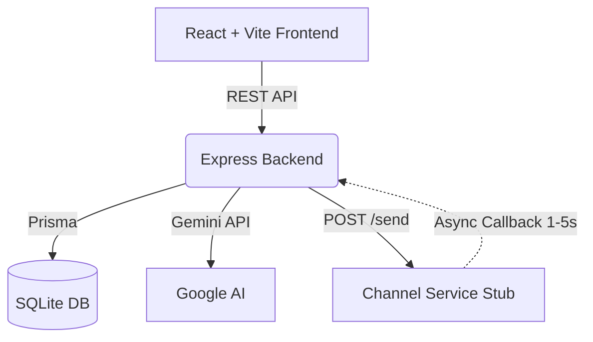

# Xeno AI-Native Mini CRM

A bold, chat-first CRM that allows marketers to reach shoppers effortlessly. Describe your audience in plain English, hit send, and watch the results.

This is my submission for the **Xeno Engineering Take-Home Assignment**.

## ✨ What Makes This "AI-Native"?

Instead of a traditional form-heavy CRM where AI is bolted on as a "drafting assistant," **the AI is the core workflow**. 
A marketer talks to the agent: *"Find VIP customers who spent over 5000 and draft a win-back campaign."*
The agent parses this intent, generates the SQL/Prisma filter rules, provides a live preview of the audience, and drafts the personalized message. The marketer just reviews and clicks "Launch".

## 🏗️ Architecture & Tradeoffs



### The Callback Delivery Loop (System Design)
The system does **not** assume 100% successful delivery.
1. When a campaign is launched, the CRM inserts `pending` communication logs and fires a batch request to the `Channel Service`.
2. The Channel Service is a separate Express app that schedules async `setTimeout` jobs.
3. It simulates realistic outcomes: `sent` -> `delivered` (90%) -> `opened` (60%) -> `clicked` (30%).
4. It calls back to the CRM's `/api/receipts` endpoint with the status updates.
5. If the CRM is down, the channel service retries with **exponential backoff**.

**Tradeoffs made for this scope:**
- **SQLite instead of PostgreSQL:** Perfect for this demo scale (~1000 customers). Prisma makes swapping to Postgres a 1-line change.
- **Sync POST instead of Message Queue:** At scale, sending 1 million messages would timeout a single API call. I'd use BullMQ/Kafka, but for this assignment, a direct `fetch()` batch call keeps the demo runnable without Redis.
- **Monolithic backend vs Microservices:** I separated the Channel Service to prove the callback loop, but kept CRM logic in one Express app for readability.

## 🚀 How to Run Locally

You need Node.js and an active internet connection.

### 1. Install Dependencies
Run the provided setup script to install all packages and seed the database:
```bash
./setup.bat
```
*(Or manually run `npm install` in `/backend`, `/frontend`, and `/channel-service`. Then in `/backend` run `npx prisma db push` and `npm run db:seed`)*

### 2. Environment Variables
In the `backend/` directory, create a `.env` file and add your Google Gemini API key:
```env
GEMINI_API_KEY="your-google-gemini-api-key"
PORT=3001
CHANNEL_SERVICE_URL="http://localhost:3002"
```

### 3. Start the Services
You need 3 terminal windows. Or run the `start.bat` script!

**Terminal 1 (Backend):**
```bash
cd backend
npm run dev
```

**Terminal 2 (Channel Service):**
```bash
cd channel-service
npm run dev
```

**Terminal 3 (Frontend):**
```bash
cd frontend
npm run dev
```

Open `http://localhost:3000` in your browser.

## 📁 File Structure

- `/backend/src/routes/ai.js` -> The brain of the chat interface.
- `/backend/src/services/segmentEngine.js` -> Pure functions converting JSON rules to Prisma WHERE clauses.
- `/backend/src/routes/campaigns.js` -> The launch logic and stat aggregation.
- `/channel-service/src/simulator.js` -> The async probabilistic delivery engine.
- `/frontend/src/components/AIChat.jsx` -> The chat UI that pre-fills forms on the right.

## 🤝 Next Steps for Scale
1. Move the DB to PostgreSQL.
2. Replace the `POST /send` with placing a job on an AWS SQS / Redis queue.
3. Add authentication (JWT) and multi-tenant logic (brand_id).
